<div align="center">

# 🎓 Engineer Hub

**A complete digital ecosystem for the Mumbai University engineering community**

Attendance tracking · Peer marketplace · Freelancing · Study resources · Placements · Results · Messaging — all in one platform.

Built as a production-oriented **MERN** application (MongoDB, Express, React, Node.js) with role-based access control, rate limiting, input validation, audit logging, and a full moderation workflow across every piece of user-submitted content.

[Features](#-features) · [Screenshots](#-screenshots) · [Tech Stack](#️-tech-stack) · [Getting Started](#-getting-started-local-development) · [Deployment](#-production-deployment) · [API](#-api-reference)

</div>

---

## 📖 About

Engineer Hub is a single platform that replaces the scattered WhatsApp groups, Google Drive folders, and Instagram DMs engineering students typically rely on for attendance math, buying/selling old project code, finding freelance gigs, sharing notes, and tracking placement drives. It ships with four roles (**Student**, **Developer**, **Admin**, **Super Admin**), each with its own dashboard and permission scope, and a moderation queue so every listing, resource, and result is reviewed before it goes live.

---

## ✨ Features

**For students**
- 📅 Attendance tracker with a 75%-eligibility calculator
- 🛒 Marketplace to buy/sell academic projects, with ratings & reviews
- 💼 Freelancing board — post projects, bid, get hired, rate freelancers
- 📚 Study resource library (notes, PYQs, books) with admin moderation
- 📊 Results tracking with a real credit-weighted SGPA/CGPA calculator (India's 10-point scale)
- 🎯 Placement & internship drives, with admin-uploaded posters
- 💬 In-app messaging between buyers/sellers and clients/freelancers
- 🔔 Notifications across in-app, email, and browser push
- 🌗 Full dark/light theme
- 🔍 Global search across marketplace, resources, freelance, and placements
- 🚩 Report/flag system for inappropriate listings

**For developers**
- 📦 List and sell code/projects on the marketplace
- 💰 Track total sales, earnings after platform fee, and pending-review listings
- 🧰 Everything students get (freelancing, messaging, resources, etc.)

**For admins**
- ✅ Moderation queues for every content type (projects, resources, results, freelance), with bulk approve/reject
- 📈 Analytics dashboard with 30-day trend charts (revenue, signups, listings, withdrawals)
- 📝 Full audit log of every moderation action
- 💰 Withdrawal review and payout processing
- 📢 Announcements and events management
- 🚩 Report review

**For super admins**
- 👑 Everything an admin can do, plus full user management (role changes, account lock/unlock, **hard delete**)
- ⚙️ Live system variables (platform fee, min withdrawal, max upload size, admin contact email)
- ☢️ Danger Zone tools — clear pending queue, reset announcements, export user data

**Platform-wide**
- 🔐 httpOnly-cookie JWT auth, bcrypt password hashing, rate limiting, input validation
- 🛡️ Helmet, NoSQL-injection sanitization, HTTP param pollution protection, CORS allow-list
- 📱 PWA — installable, offline fallback, push notifications
- 🔎 SEO-ready (sitemap, structured data, meta tags)
- 🩺 Error monitoring hooks (Sentry-ready, no-op if not configured)

---

## 📸 Screenshots

A full walkthrough of the platform from every role's point of view — registration through to their dashboard.

### 👨‍🎓 Student

| Register as a Student | Student Dashboard | Student Profile |
|---|---|---|
| 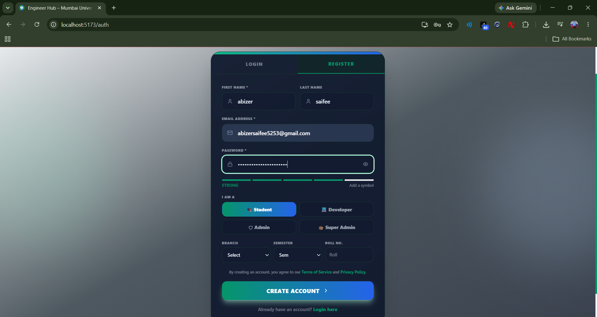 | 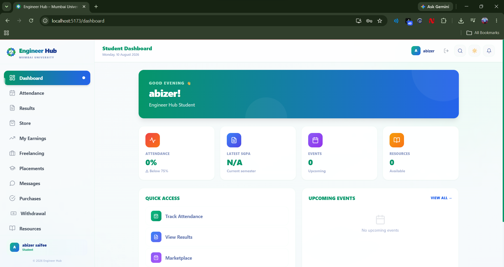 | 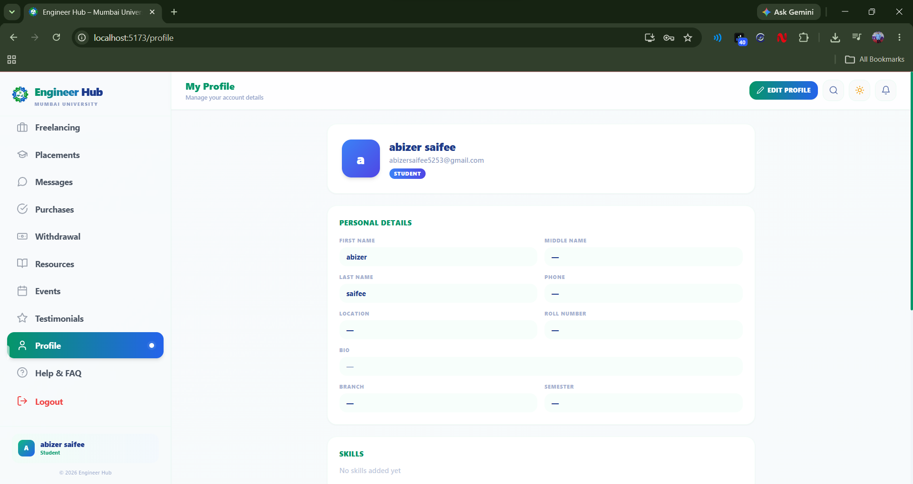 |

### 💻 Developer

| Register as a Developer | Developer Dashboard | Freelancing Hub |
|---|---|---|
| 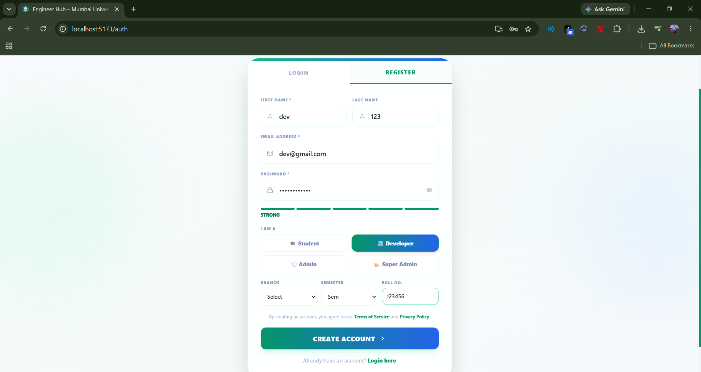 | 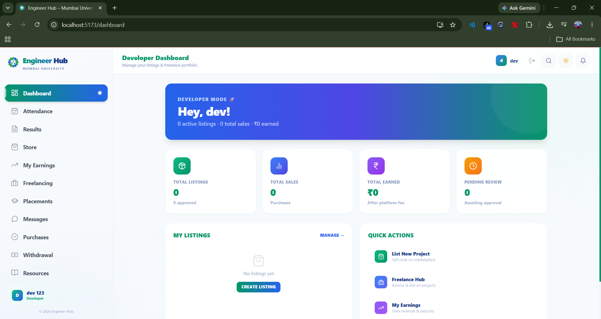 | 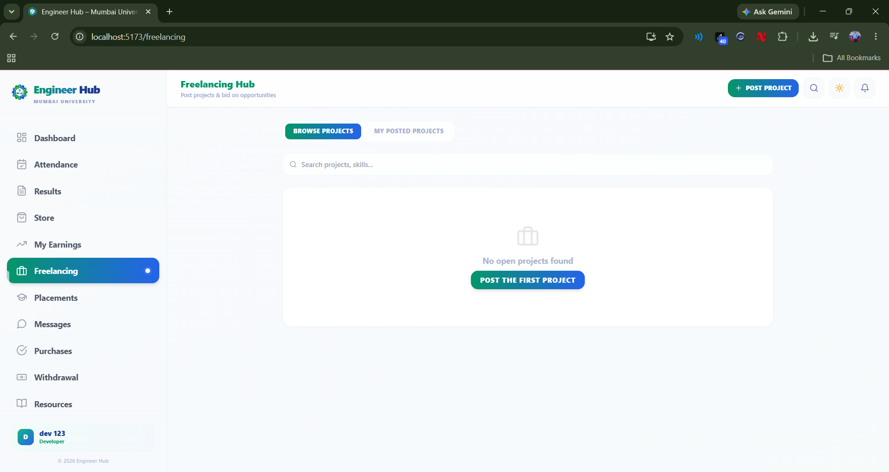 |

### 🛡️ Admin

| Register as an Admin | Admin Dashboard | Approval Hub |
|---|---|---|
| 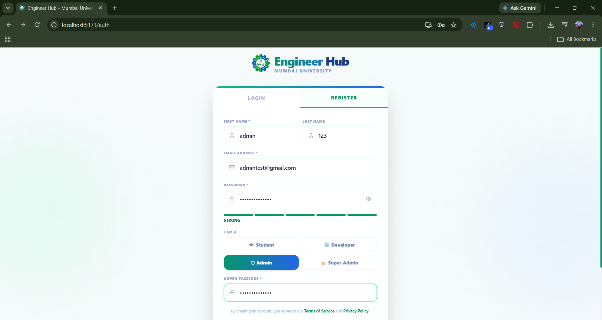 | 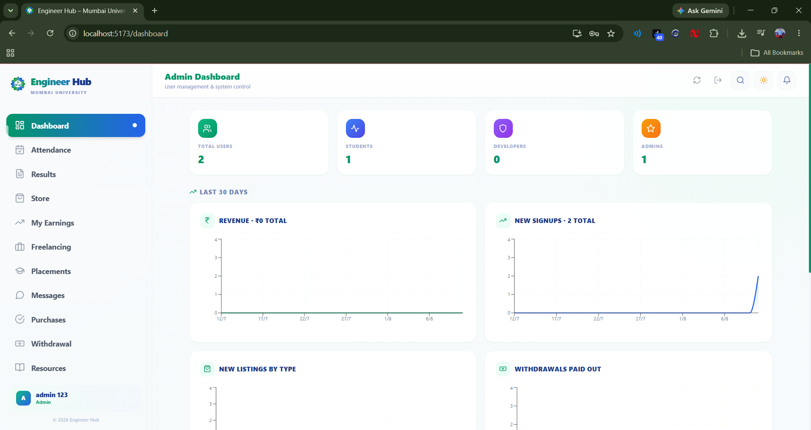 | 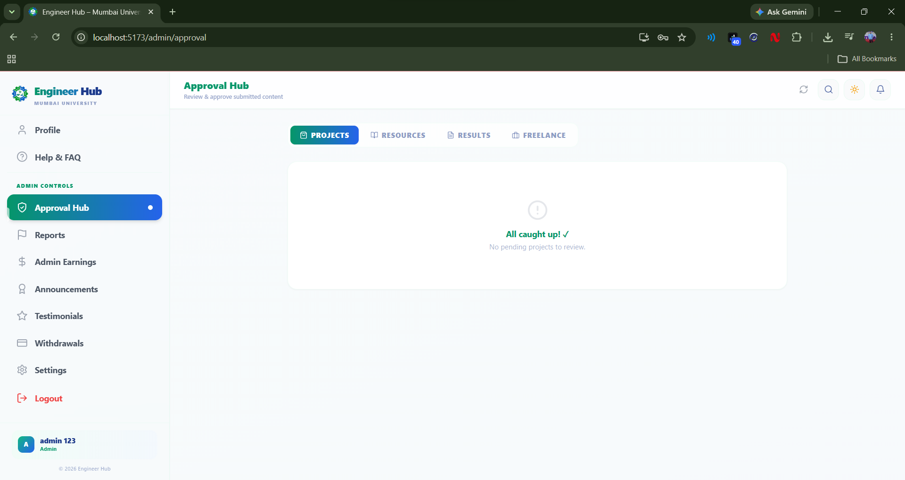 |

### 👑 Super Admin

| Register as a Super Admin | Overview | Users | System |
|---|---|---|---|
| 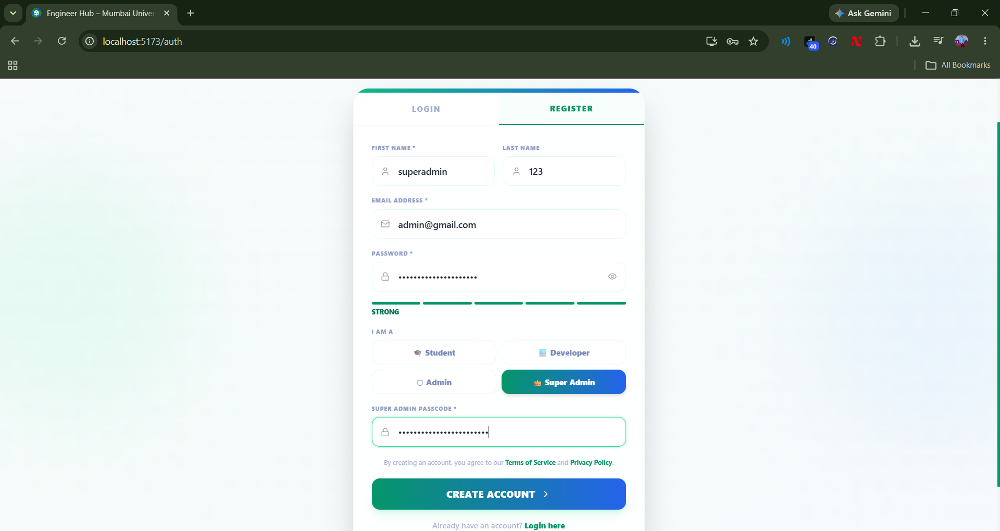 | 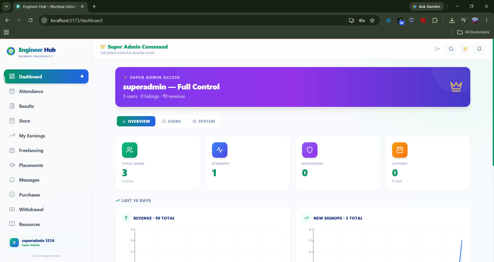 | 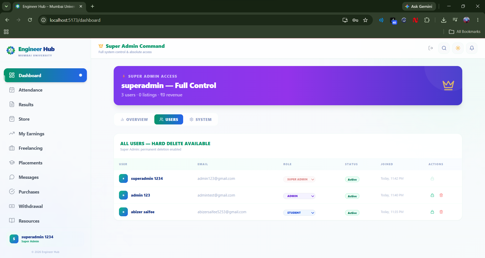 | 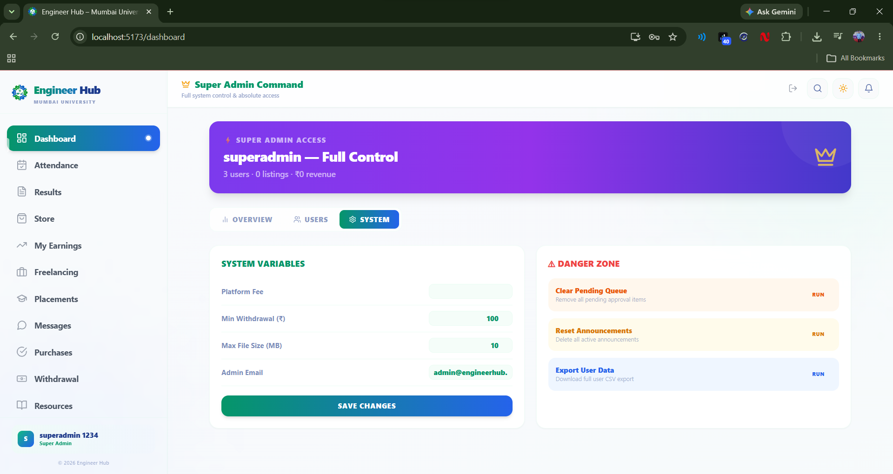 |

---

## 🏗️ Tech Stack

| Layer | Technology |
|---|---|
| Frontend | React 18, Vite, Tailwind CSS, Framer Motion, Recharts |
| Backend | Node.js, Express 4, MongoDB, Mongoose |
| Auth | JWT via httpOnly cookies |
| Security | Helmet, express-rate-limit, express-validator, hpp, NoSQL sanitization |
| Email | Nodemailer (SMTP) |
| Push | web-push (VAPID) |
| File uploads | Multer (local disk storage) |
| Monitoring | Sentry (optional, auto-disables without a DSN) |
| Deployment | Vercel (frontend) · Render (backend) · MongoDB Atlas (database) |

---

## 📁 Project Structure

```
engineer-hub/
├── backend/
│   ├── server.js               # Express app entry point
│   ├── instrument.js           # Sentry preload (required by the SDK)
│   ├── render.yaml             # Render deployment blueprint
│   ├── .env.example            # Copy to .env and fill in real values
│   └── src/
│       ├── config/             # DB connection, env validation, Sentry
│       ├── controllers/        # Route handlers (24 modules)
│       ├── middleware/         # Auth, rate limiting, uploads, validators
│       ├── models/             # Mongoose schemas
│       ├── routes/             # Express routers
│       └── utils/              # Email templates, push helper, etc.
│
├── frontend/
│   ├── index.html
│   ├── .env.example             # Copy to .env and fill in real values
│   ├── public/                  # Icons, manifest, service worker, robots.txt
│   └── src/
│       ├── components/          # Shared UI (Sidebar, Navbar, modals, etc.)
│       ├── contexts/            # Auth & Theme context providers
│       ├── pages/
│       │   ├── admin/           # Admin-only dashboards
│       │   ├── auth/            # Login/register
│       │   ├── common/          # Shared student-facing pages
│       │   ├── developer/       # Developer role dashboard
│       │   ├── student/         # Student dashboard
│       │   └── superadmin/      # Super admin dashboard
│       ├── services/            # API client (api.js)
│       └── utils/               # Formatters, constants, push subscription helper
│
└── screenshots/                 # README screenshots
```

---

## ⚡ Getting Started (Local Development)

### Prerequisites
- **Node.js 18+**
- **MongoDB** — either installed locally, or a free [MongoDB Atlas](https://cloud.mongodb.com) cluster

### 1. Clone the repo

```bash
git clone https://github.com/<your-username>/engineer-hub.git
cd engineer-hub
```

### 2. Backend setup

```bash
cd backend
npm install
cp .env.example .env
```

Open `backend/.env` and fill in the required values (see [Environment Variables](#-environment-variables) below for what each one does). At minimum, you need:

```env
MONGODB_URI=mongodb://127.0.0.1:27017/engineerhub
JWT_SECRET=<generate with: openssl rand -hex 64>
COOKIE_SECRET=<generate with: openssl rand -hex 32>
FRONTEND_URL=http://localhost:5173
ADMIN_PASSCODE=<pick a strong passcode>
SUPER_ADMIN_PASSCODE=<pick a strong passcode>
```

Then start the server:

```bash
npm run dev
```

The server **validates your environment on boot** and will tell you exactly what's missing or insecure before it starts.

### 3. Frontend setup

```bash
cd frontend
npm install
cp .env.example .env
```

`frontend/.env` just needs:

```env
VITE_API_URL=http://localhost:5000/api
```

Then start the dev server:

```bash
npm run dev
```

The app will be running at **http://localhost:5173**, talking to the API at **http://localhost:5000**.

### 4. Create your accounts

Register normally through the sign-up page. Pick a role (**Student**, **Developer**, **Admin**, or **Super Admin**) — for Admin/Super Admin, you'll need to enter the `ADMIN_PASSCODE` / `SUPER_ADMIN_PASSCODE` you set in `backend/.env`.

---

## 🔧 Environment Variables

### `backend/.env`

| Variable | Required | Description |
|---|---|---|
| `NODE_ENV` | – | `development` or `production` |
| `PORT` | – | API port (default `5000`) |
| `MONGODB_URI` | ✅ | MongoDB connection string (local or Atlas) |
| `JWT_SECRET` | ✅ | Long random string used to sign auth tokens (≥ 32 chars) |
| `JWT_EXPIRES_IN` | – | Token lifetime, e.g. `7d`. **Leave unset and tokens never expire** — set this unless you have a reason not to |
| `COOKIE_SECRET` | ✅ | Long random string used to sign cookies (≥ 32 chars) |
| `FRONTEND_URL` | ✅ | Deployed frontend origin(s), comma-separated. Must exactly match for CORS to work |
| `MAX_LOGIN_ATTEMPTS` | – | Failed logins before lockout (default `5`) |
| `LOCK_TIME_MINUTES` | – | Lockout duration (default `15`) |
| `ADMIN_PASSCODE` | ✅ | Shared passcode required to self-register as Admin |
| `SUPER_ADMIN_PASSCODE` | ✅ | Shared passcode required to self-register as Super Admin |
| `EMAIL_HOST` / `EMAIL_PORT` / `EMAIL_USER` / `EMAIL_PASS` / `EMAIL_FROM` | optional | SMTP config. Blank = emails are logged to console instead of sent |
| `VAPID_PUBLIC_KEY` / `VAPID_PRIVATE_KEY` / `VAPID_SUBJECT` | optional | Generate with `npx web-push generate-vapid-keys`. Blank = push notifications no-op |
| `SENTRY_DSN` | optional | Blank = errors only logged to console |
| `CLOUDINARY_CLOUD_NAME` | – | Reserved, currently unused — the app stores images as plain URLs / local uploads |

> ⚠️ **`ADMIN_PASSCODE` / `SUPER_ADMIN_PASSCODE` are effectively an invite code** — anyone who has one can self-register with that role, no approval step. Use long random values in anything beyond local testing, and don't post them publicly.

### `frontend/.env`

| Variable | Required | Description |
|---|---|---|
| `VITE_API_URL` | ✅ | Base URL of the backend API, including `/api` |
| `VITE_VAPID_PUBLIC_KEY` | optional | Must exactly match backend's `VAPID_PUBLIC_KEY` |
| `VITE_SENTRY_DSN` | optional | Frontend error monitoring |

Full templates with comments live in [`backend/.env.example`](./backend/.env.example) and [`frontend/.env.example`](./frontend/.env.example) — copy them to `.env` and never commit the real file (already covered by `.gitignore`).

---

## 🌐 Production Deployment

1. **Database** — create a [MongoDB Atlas](https://cloud.mongodb.com) cluster, whitelist the IPs your host will connect from, grab the connection string.
2. **Backend → [Render](https://render.com)** — it auto-detects `backend/render.yaml`. Set all the required env vars from the table above with real production values.
3. **Frontend → [Vercel](https://vercel.com)** — root directory: `frontend`. Set `VITE_API_URL` to your live Render URL + `/api`.
4. **Go back to Render** and set `FRONTEND_URL` to your real live Vercel URL — both must match exactly or CORS will reject every request.
5. Register your own Admin/Super Admin account using your rotated passcodes before sharing the live link.

---

## 📊 API Reference

All routes are prefixed with `/api`. Health check: `GET /api/health`.

`/auth` · `/users` · `/marketplace` · `/orders` · `/earnings` · `/withdrawals` · `/attendance` · `/resources` · `/events` · `/announcements` · `/testimonials` · `/results` · `/freelancers` · `/analytics` · `/settings` · `/notifications` · `/reports` · `/uploads` · `/placements` · `/push` · `/audit-logs` · `/search` · `/messages`

Auth is via an **httpOnly cookie** set on login/register — no manual token handling needed on the client.

---

## 📝 Known Limitations

- No 2FA or active-session management yet
- Messaging is polling-based (~5s refresh), not real-time WebSockets
- No automated test suite
- Uploaded files (placement posters) are stored on local disk — **ephemeral on Render's free tier** and wiped on redeploy/restart. Move to S3/Cloudinary/R2 before relying on it in production.

Contributions addressing any of the above are very welcome — see below.

---

## 🤝 Contributing

Issues and pull requests are welcome!

1. Fork the repo and create a branch: `git checkout -b feature/your-feature`
2. Make your changes, following the existing code style
3. Test locally (both frontend and backend)
4. Open a pull request describing what changed and why

Please **never commit `.env` files or any credentials** — see `.gitignore`.

## 📄 License

Built for the Mumbai University engineering community. Feel free to fork and adapt for your own campus.
